# Rehan Mohammed

<em>currently exploring consensus mechanisms for adversarial multi-agent verification, and quota-aware orchestration over rate-limited data sources.</em>

<strong>building something great.</strong>

Prior experience in co-founding a startup and scaled tech inside others, first commit to real users. I've published research, and I've written drone automation algorithms, where a bug is a crash rather than a stack trace. The habit that ties it together: build the thing that does the work, then build the thing that builds it. These days that means fleets of agents working while I sleep.

### Two things I firmly believe

1. **Obsession can win you the world.**
2. **Agents as a Service (AaaS) is the future.**

`TypeScript` `Next.js` `Python` `Postgres` `MCP` `Serverless`

📫 **rehanmoin91@gmail.com** · I answer every email.

